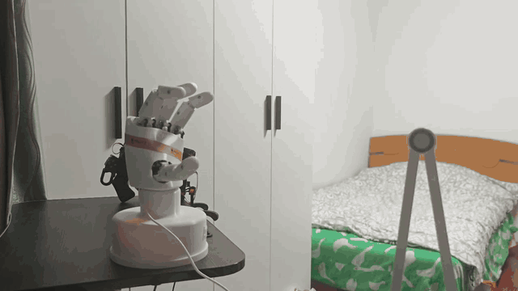
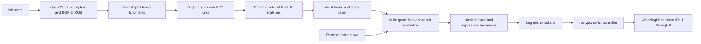

# AmazingHand-Vision-Rock-Paper-Scissors

Vision-based Rock-Paper-Scissors human–robot interaction demo using Pollen Robotics AmazingHand and real-time hand gesture recognition.

A webcam observes the player's hand, MediaPipe estimates hand landmarks, and a geometric classifier recognizes rock, paper, or scissors. An AmazingHand executes its randomly selected move over a serial connection and responds to the result with expressive motion sequences: **proud**, **shame**, and **challenge**.

This is an independent application built on the open-source AmazingHand platform. The project-specific work covers gesture classification and temporal filtering, game orchestration, pose definitions, expressive sequences, and integration with the physical hand. The mechanical design, servo communication library, and hand landmark model belong to their respective upstream projects; they are not claimed as original work here.

## Demo and scope

- Physical control of eight servo IDs through `rustypot.Scs0009PyController`.
- Single-hand landmark tracking with live finger angles, open/closed states, and gesture overlays.
- Rule-based RPS classification with a 15-frame voting window.
- Twenty rounds per run, with random robot moves and result-dependent feedback.
- A retained MuJoCo controller documents the earlier simulation stage.

**Current interaction:** the robot reveals its move first, then waits for the player's recognized gesture. This is an interaction demonstration, not a simultaneous or competition-fair game. The robot does not choose a counter-move from the player's gesture.



**Six consecutive visible rounds · 1.5× playback · approximately 22.5 seconds.** The excerpt uses source time 00:00.8–00:34.5 and retains the full scene. Round boundaries were identified visually; the recording contains no synchronized game log.

[Watch or download the complete original video](assets/VID_20260912_235052.mp4) (109.5 s, 38.4 MB; original audio retained). GitHub may offer a download rather than inline playback for the MP4. The GIF is silent.

See [media provenance and regeneration](assets/README.md) and the [development workflow](docs/development-workflow.md). The video demonstrates the interaction; no accuracy or frame-rate benchmark is claimed.

### Quick start

```powershell
git clone https://github.com/zbylink/AmazingHand-Vision-Rock-Paper-Scissors.git
Set-Location AmazingHand-Vision-Rock-Paper-Scissors
# Use a 64-bit Python 3.12 interpreter.
python -m venv .venv
.\.venv\Scripts\python.exe -m pip install -r requirements-lock.txt
.\.venv\Scripts\python.exe -m pip check
.\.venv\Scripts\python.exe -m unittest discover -s tests -v
.\.venv\Scripts\python.exe scripts/vision_test.py --camera 0
```

The lock file records the existing environment, not a separately verified clean install. Follow the installation notes if resolution fails. Before running `main.py`, configure the COM port and verify servo calibration as described below; controller construction enables torque.

## Architecture and workflow



The vision worker runs in a daemon thread. The main thread displays the latest annotated image and handles the game and hardware commands. It does not perform synchronized motion/vision scheduling.

Each round:

1. Move to `middle` and update the camera display for 0.5 s.
2. Select `rock`, `paper`, or `scissors` using `random.choice`, send the pose, and update the display for 1 s.
3. Wait for a stable human label, convert it to lowercase, and clear the vote history.
4. Evaluate the result from the **robot's perspective**.
5. Run the corresponding feedback and proceed to the next round.

The vision thread continues processing during robot actions. Recognition is not gated to the human-response phase; see the stale-result limitation below.

## Hardware

| Component | Requirement |
|---|---|
| Robotic hand | Pollen Robotics AmazingHand with four fingers and eight Feetech SCS0009 servos, matching the current controller |
| Servo addressing | Unique IDs `1`–`8`, mapped to the pose-array order |
| Serial interface | Compatible USB-to-servo TTL bus interface with a Windows COM port; do not connect RS-232 voltage levels directly to a TTL bus |
| Power | Supply and wiring appropriate to the exact hand, servos, and bus interface; follow the upstream assembly documentation |
| Camera | Windows-accessible webcam; default OpenCV index `0` |
| Computer | Windows with a desktop session for OpenCV GUI windows and a compatible Python environment |

Use the [upstream AmazingHand repository](https://github.com/pollen-robotics/AmazingHand) for assembly, wiring, calibration, and mechanical resources. Confirm the hardware revision before reusing these poses. The local source uses SCS0009 control and must not be assumed compatible with every later AmazingHand revision.

## Software and environment

### Observed local environment

The following values were read on **2026-09-29** from the existing project environment at `AmazingHand/Demo/.venv`. Package imports were checked without opening the camera or constructing the hardware controller. These are **installed versions**, not a claim that a clean installation or a hardware run was validated during documentation preparation.

| Component | Observed version / status |
|---|---|
| Operating system | Windows 11; platform string `Windows-11-10.0.26200-SP0` |
| Python | `3.12.14`, 64-bit AMD64 |
| pip | `25.0.1` |
| MediaPipe | `0.10.14`; `mp.solutions.hands` import verified |
| NumPy | `2.5.3` |
| opencv-python | Distribution `5.0.0.93` |
| opencv-contrib-python | Distribution `5.0.0.93`; also installed in the existing environment |
| OpenCV runtime | `cv2.__version__ == '5.0.0'` |
| rustypot | `1.7.0`; `Scs0009PyController` import verified |
| MuJoCo | `3.12.0`; optional historical simulation dependency |
| Git for Windows | `2.55.0.windows.3` |
| OpenSSH | `OpenSSH_for_Windows_9.5p2`, LibreSSL `3.8.2` |
| Conda | `26.5.3` available on the machine; not required by this demo |
| IDE, camera driver, bus-adapter driver, servo firmware | Not recorded |

The local parent AmazingHand checkout points to `pollen-robotics/AmazingHand`, with HEAD `3e8241074df3436a3044ced4881e3bb2133aa725`. This identifies its Git base, not every local modification or the commit of this independent RPS repository.

The machine's default `python` resolves to an unrelated Anaconda environment. Use the project interpreter explicitly or activate the correct environment before running commands.

### Dependency considerations

Runtime imports are `cv2`, `mediapipe`, `numpy`, and `rustypot`; the remaining imports are Python standard-library modules. PyTorch, ROS, Dora, and MuJoCo are not required by the physical-hand entry point.

This source uses **legacy MediaPipe Solutions**, not the newer Tasks API. Do not blindly upgrade MediaPipe: removal of `mediapipe.solutions` in newer releases is discussed in the [official MediaPipe issue tracker](https://github.com/google-ai-edge/mediapipe/issues/6192). The observed `0.10.14` installation exposes the required API.

The existing environment contains two OpenCV distributions sharing `cv2`. For a new environment, use one GUI-enabled distribution. The setup below selects `opencv-contrib-python`, which supplies `cv2`; do not additionally install the headless or plain OpenCV distributions into that environment. See the [OpenCV Python package instructions](https://pypi.org/project/opencv-contrib-python/).

## Repository layout and key modules

The minimal independent repository layout assumed by the commands below is:

```text
AmazingHand-Vision-Rock-Paper-Scissors/
├── README.md
├── main.py
├── vision.py
├── hand_control.py
├── poses.py
├── test_real_hand.py
├── hand_control_mujoco.py       # historical, optional; upstream models not bundled
├── requirements.txt            # direct runtime dependencies
├── requirements-lock.txt       # observed runtime dependency closure
├── LICENSE                     # existing repository MIT license
├── assets/                     # six-round GIF, unmodified MP4, provenance
├── scripts/                    # vision diagnostic and GIF regeneration
├── tests/                      # hardware-free recognition/pose checks
└── docs/                       # development workflow and upstream license
```

The inspected implementation originally lives under `AmazingHand/Demo/rps_hand/`. Keep the four core Python files together: they use local imports. If retaining the original nesting, enter `Demo/rps_hand` before running the commands. The four original application modules are included at the repository root without behavioral changes.

| Module | Responsibility and important behavior |
|---|---|
| `main.py` | Initializes hardware and vision, runs 20 rounds, evaluates outcomes, and requests cleanup in `finally`; importing this file also executes the program |
| `vision.py` | Angle helpers, RPS rules, voting, `RPSVision`, camera processing thread, and annotation; `read()` returns the latest cached result |
| `hand_control.py` | `AmazingHand` hardware adapter, serial configuration, pose writes, linear interpolation, and expressive sequences |
| `poses.py` | Eight-element NumPy arrays of servo target angles in degrees, exposed through `POSES` |
| `test_real_hand.py` | Physical smoke test: middle → shame → middle → stop; this moves hardware and is not a unit test |
| `hand_control_mujoco.py` | Historical simulation adapter; loads an external upstream MJCF scene and is not selected by `main.py` |

### Other test programs found in the original parent directory

These files exist in `AmazingHand/Demo/`, **outside** the minimal `rps_hand` module set. Copying only `rps_hand` does not include them.

| File | Purpose / caveat |
|---|---|
| `camera_test.py` | Standalone camera `0` preview; Q exits |
| `hand_tracking_test.py` | Standalone landmark, finger-state, and RPS visualization |
| `vision_module_test.py` | Older `RPSVision` consumer; currently missing `vision.start()` and assumes synchronous reads; needs adaptation before use |
| `rock_test.py` | MuJoCo pose experiment; its angle array differs from the current physical `rock` pose |
| `paper_test.py` | MuJoCo paper-pose experiment |
| `scissors_test.py` | MuJoCo pose experiment; its angle array differs from the current physical `scissors` pose |

The three simulation experiments expect `AHSimulation/AHSimulation/AH_Left/mjcf/scene.xml` relative to `Demo`. The historical adapter expects `../AHSimulation/AHSimulation/AH_Left/mjcf/scene.xml` relative to `rps_hand`. Preserve the upstream model and asset hierarchy if using them. Their existence does not make simulation runnable from the minimal repository alone.

## Installation

### 1. Obtain the code

In PowerShell, clone this repository:

```powershell
git clone https://github.com/zbylink/AmazingHand-Vision-Rock-Paper-Scissors.git
Set-Location AmazingHand-Vision-Rock-Paper-Scissors
```

Confirm that `main.py`, `vision.py`, `hand_control.py`, and `poses.py` are present. The root layout in this release contains these files.

### 2. Use the existing environment or create a clean one

For the original local checkout, the verified interpreter can be selected without activation:

```powershell
$ProjectPython = 'C:\Users\zby\AmazingHand\Demo\.venv\Scripts\python.exe'
Set-Location 'C:\Users\zby\AmazingHand\Demo\rps_hand'
& $ProjectPython --version
```

For a new machine, install 64-bit Python 3.12 and use its actual executable path. `python --version` must identify the intended interpreter before creating the environment. The Windows `py` launcher was not available in the inspected shell and is not assumed here.

```powershell
python --version
python -m venv .venv
$ProjectPython = (Resolve-Path '.venv\Scripts\python.exe').Path
& $ProjectPython -m pip install --upgrade pip
& $ProjectPython -m pip install -r requirements-lock.txt
& $ProjectPython -m pip check
```

The lock file records the **observed package metadata** for the runtime dependency closure while selecting a single OpenCV provider. `requirements.txt` contains only the four direct dependency pins. Package-index availability and clean-environment resolution have not been verified. If the resolver cannot obtain a listed version or reports incompatible requirements, retain the error, check your Python architecture and configured package index, and resolve in the disposable environment. Do not conceal conflicts with `--no-deps` or overwrite a working hardware environment.

This release adds `requirements-lock.txt` from the original installed runtime dependency closure, excluding unrelated editable upstream projects. It passes dependency checks in the original environment but is not a clean-install certification. Once a clean installation and the staged tests below succeed, record your reproduced environment separately:

```powershell
& $ProjectPython -m pip freeze | Set-Content -Encoding utf8 requirements-reproduced.txt
& $ProjectPython -m pip --version
& $ProjectPython -c "import sys, platform; print(sys.executable); print(sys.version); print(platform.platform())"
```

Review and commit the reproduced lock file with the relevant code revision. Recreate it using `& $ProjectPython -m pip install -r requirements-lock.txt` on a compatible platform; a freeze file is not a cross-platform compatibility guarantee.

### 3. Verify imports without moving hardware

```powershell
& $ProjectPython -c "import cv2, mediapipe as mp, numpy; from rustypot import Scs0009PyController; print(cv2.__version__, mp.__version__, numpy.__version__); print(mp.solutions.hands.Hands); print('Imports OK')"
```

This imports the controller class but does not instantiate it. **Do not use `import main` as a smoke test:** it starts the application, including hardware initialization.

To query package versions in the selected interpreter:

```powershell
& $ProjectPython -m pip show mediapipe numpy opencv-python opencv-contrib-python rustypot mujoco
git --version
ssh -V
```

For unrecorded driver and firmware versions, consult Windows Device Manager and the relevant vendor configuration tool; do not infer them from Python packages.

## Configure the physical hand

### COM port and communication

Find the bus adapter in **Device Manager → Ports (COM & LPT)**, or list serial device names:

```powershell
[System.IO.Ports.SerialPort]::GetPortNames()
```

Edit `AmazingHand.__init__()` in `hand_control.py`:

```python
self.controller = Scs0009PyController(
    serial_port="COM9",  # replace with this computer's adapter port
    baudrate=1000000,
    timeout=2,
)
```

The checked-in default is `COM9`, at `1,000,000` baud with a timeout argument of `2`. Port selection is hard-coded; there is currently no `--port` flag or environment-variable override. Match the configured bus baud rate and ensure no other program owns the port.

**Constructing `AmazingHand()` immediately opens the controller and writes torque-enable value `1` to IDs 1–8.** `start()` is a no-op. The message `AmazingHand connected` is not a separate position, calibration, or health check.

`stop()` writes value `2` to those IDs, following the On/Off/Free convention shown in the [upstream SCS0009 example](https://github.com/pollen-robotics/AmazingHand/blob/main/PythonExample/AmazingHand_Demo_Both.py). It does not establish a hardware emergency stop or explicitly close the serial port.

### Servo order and pose calibration

The `poses.py` order is:

```text
array index:   0   1 | 2   3 | 4   5 | 6   7
servo ID:      1   2 | 3   4 | 5   6 | 7   8
finger pair:     1   |   2   |   3   |   4
```

Pose comments associate these pairs with index, middle, ring, and thumb. Verify the actual wiring, hand side, zero offsets, and motion directions on your assembly. Some expressive-pose comments are inconsistent about thumb posture; numeric targets and observed mechanics are the source of truth.

Current main targets, in **degrees**:

| Pose | IDs 1–8 |
|---|---|
| `middle` | `[3, 0, -5, -8, -2, 5, -12, 0]` |
| `rock` | `[88, -88, 88, -88, 88, -88, 88, -88]` |
| `paper` | `[-32, 35, -40, 27, -37, 40, -15, 75]` |
| `scissors` | `[-62, 15, -20, 57, 82, -82, 82, -82]` |

These are assembly-specific targets, not universal safe limits. `move()` converts each target with `np.deg2rad`, writes IDs sequentially, and sleeps 5 ms after each write. There is no synchronized eight-servo write, joint-limit validation, position feedback, or arrival detection in this application.

## Run and reproduce

### Stage 1: camera and vision only

Use a well-lit view with one human hand visible. Keep the robot out of the recognition region. The default is `RPSVision(camera_id=0)`; change the argument to try another camera. For the full game, edit `vision = RPSVision()` in `main.py` accordingly.

You can run the included diagnostic with `& $ProjectPython scripts/vision_test.py --camera 0`. The equivalent PowerShell block below runs from the directory containing `vision.py`, starts the current threaded API, waits for a first frame, and never constructs the hardware controller:

```powershell
@'
import time
import cv2
from vision import RPSVision

vision = RPSVision(camera_id=0)
try:
    vision.start()
    deadline = time.monotonic() + 10
    received_frame = False
    while True:
        frame, gesture = vision.read()
        if frame is None:
            if time.monotonic() > deadline:
                raise RuntimeError("No initial frame within 10 seconds")
            time.sleep(0.01)
            continue
        if not received_frame:
            print("Camera ready. Show rock, paper, scissors; press Q to exit.")
            received_frame = True
        cv2.imshow("Vision-only RPS", frame)
        if cv2.waitKey(1) & 0xFF in (ord("q"), ord("Q")):
            break
finally:
    vision.stop()
'@ | & $ProjectPython -
```

Expected result: a live window with landmarks, finger states/angles, `Gesture`, and `Stable`. Present all three gestures and remove the hand to inspect `UNKNOWN` and unstable behavior. The current API has no frame timestamp, so this diagnostic can detect missing startup frames but cannot reliably detect a frozen cached frame after startup.

### Stage 2: hardware smoke test

First complete the safety and calibration checks below, and ensure the work area is clear. This command moves the real hand:

```powershell
& $ProjectPython .\test_real_hand.py
```

Expected sequence: `middle` → wait 1 s → `shame` → wait 2 s → return to `middle` → wait 2 s → `stop()`. The shame routine itself first requests rock, waits 0.3 s, and interpolates toward shame. This test does not validate all poses or communication fault handling.

### Stage 3: full game

```powershell
& $ProjectPython .\main.py
```

Watch for `AmazingHand connected`, round numbers, `Robot chose`, `Human detected`, and `Draw!`, `Robot wins!`, or `Robot loses!`. Respond when the terminal requests your hand.

- The run attempts 20 rounds; change `range(20)` in `main.py` to alter this.
- Q/q is handled in the main human-gesture waiting loop while the OpenCV window has focus. During timed display updates, key events are consumed without an exit check, so Q is not a reliable global stop.
- Ctrl+C requests Python interruption. Neither Q nor Ctrl+C substitutes for physical power isolation.
- `finally` attempts to stop vision, return the hand to middle, update the display, and call `hand.stop()`. Cleanup is best effort; exceptions can interrupt this sequence.

The printed human-detection `delay` starts before robot selection and includes robot movement/display waiting and the human response. It is **not** a measurement of vision inference latency.

## Gesture recognition details

MediaPipe is configured with `static_image_mode=False`, `max_num_hands=1`, and detection/tracking confidence thresholds of `0.5`. OpenCV frames are converted from BGR to RGB before inference.

`calculate_angle(a, b, c)` computes the angle between vectors `a-b` and `c-b` using the landmark `x`, `y`, and `z` values, clamps cosine to `[-1, 1]`, and returns degrees. A zero-length vector returns `0`. These are image-landmark coordinates, not calibrated metric joint measurements.

| Finger | Landmark triplet(s) | Open condition |
|---|---|---|
| Thumb | `(1, 2, 3)` and `(2, 3, 4)` | Both angles strictly greater than 150° |
| Index | `(5, 6, 7)` | Angle strictly greater than 160° |
| Middle | `(9, 10, 11)` | Angle strictly greater than 160° |
| Ring | `(13, 14, 15)` | Angle strictly greater than 160° |
| Pinky | `(17, 18, 19)` | Angle strictly greater than 160° |

Classification rules:

| Label | Required finger state |
|---|---|
| `ROCK` | All five fingers closed |
| `PAPER` | All five fingers open |
| `SCISSORS` | Index and middle open; ring and pinky closed; thumb ignored |
| `UNKNOWN` | Any other combination, or no hand detected |

This application does not train a custom RPS neural network. MediaPipe provides landmark inference; the downstream RPS decision is geometric and rule-based.

The buffer stores the latest 15 processed frames. Fewer than 15 entries gives `WAITING`; once full, a valid label requires at least 10 occurrences, otherwise the result is `UNSTABLE`. Unknown frames occupy buffer slots but do not vote for a valid label. A stable result does not require 10 consecutive frames. At an illustrative 30 processed frames/s, filling 15 entries takes about 0.5 s; no fixed frame rate or recognition latency is guaranteed.

## Robot actions and feedback

| Outcome | Sequence in `main.py` |
|---|---|
| Draw | `middle`, then next round; no challenge |
| Robot wins | `proud` → `middle` → `challenge` |
| Robot loses | `shame` → `middle` → `challenge` |

- **Proud:** alternate `proud_left`, `proud_right`, `proud_left`, `proud_right`, with 0.2 s waits between the first three transitions. `proud_base` exists in the pose dictionary but is unused by this sequence.
- **Shame:** request `rock`, wait 0.3 s, then linearly interpolate stored rock angles toward `shame`, with nominal duration 0.8 s and 50 steps. The implementation emits 51 target sets; serial write time adds to elapsed duration. Interpolation starts from the named pose, not measured servo positions.
- **Challenge:** repeat `challenge_open` → wait 0.3 s → `challenge_close` → wait 0.2 s, twice.

The labels describe intended expressive feedback, not measured emotion recognition. Only the shame transition uses interpolation; other pose transitions are direct target writes. No collision, current, or force feedback is implemented.

## Troubleshooting and validation

| Symptom | Check / next step |
|---|---|
| `ModuleNotFoundError` | Print `sys.executable`; install with the same interpreter's `-m pip` |
| `mediapipe` has no `solutions` | Check its version and restore a compatible legacy environment; Tasks migration requires code changes |
| OpenCV import/GUI error | Check for multiple `cv2` providers and headless packages; rebuild a clean environment with one GUI provider |
| Cannot open camera | Close other camera apps, enable Windows camera access for desktop apps, and try another camera index |
| Old `vision_module_test.py` reports no camera frame | It never starts the worker; use the current vision-only snippet above |
| `WAITING` / `UNSTABLE` persists | Hold one clear gesture, inspect angle overlays, improve lighting, and reduce occlusion |
| Rock fails while other gestures work | The rule requires the thumb to be closed too; inspect both thumb angles |
| COM port unavailable | Confirm Device Manager port, adapter driver, USB connection, and exclusive access |
| Servo timeout / missing response | Check power, common ground, TTL wiring, baud rate, unique IDs, and hardware compatibility |
| Wrong direction or mechanical strain | Isolate power, then verify hand side, servo ordering, calibration, and pose limits before retrying |
| Old gesture accepted in the next round | Current reset only clears the buffer; cached labels and continuous background voting can carry stale results |
| Frozen video after disconnection | Failed capture reads retry without invalidating the cached frame or reporting a timeout |
| MuJoCo scene missing | Restore the upstream model/asset tree and use the documented working directory |

Run the bundled hardware-free checks using `& $ProjectPython -m unittest discover -s tests -v`. They cover geometric edge cases, RPS labels, voting thresholds, and pose-array integrity; they do not certify servo travel or camera accuracy.

For reproducible evaluation, record the repository commit, package lock, camera model/index/resolution, lighting, distance, hardware revision, servo calibration, and COM settings. Count recognition results over a stated number of trials per gesture; record failures as well as successes. The current code does not calculate accuracy, keep scores, save structured logs, or persist video.

## Known limitations

1. **Thread consistency:** cached frame/label fields and the vote deque have no lock. `reset()` clears only the deque, not `latest_stable_gesture`; a reset can race with worker voting. Round-scoped fresh-frame validation is absent.
2. **Initialization and cleanup:** controller construction, camera construction, and startup happen before the main `try/finally`. A camera or initialization failure after torque enable may bypass cleanup. A failure while returning to middle can prevent `stop()` from running.
3. **Camera shutdown:** `stop()` joins the worker for at most one second, then releases camera/MediaPipe resources; successful worker termination is not verified. The main cleanup subsequently tries to display a cached frame, which may recreate a window after destruction.
4. **Hardware control:** no feedback-based completion, current monitoring, pose bounds, motion watchdog, or per-servo recovery. Time-based waits are assumptions about motion completion.
5. **Recognition:** one hand, fixed thresholds, sensitivity to viewpoint/occlusion, no user calibration, and no explicit distinction between the human and any other hand-shaped object in view.
6. **Game:** robot moves first, no countdown, no response timeout, no scoreboard, and no deterministic random seed setting. A player can observe the robot move before responding.
7. **Packaging:** the original application has no command-line configuration or bundled simulation assets. This publication adds an observed dependency lock and hardware-free tests, but clean-install and physical end-to-end validation remain necessary on each target setup.

## Hardware safety

- Secure the hand and keep fingers, hair, wires, and objects away from linkages before constructing the controller. Torque is enabled during construction.
- Verify IDs, hand side, calibration, power, and mechanical travel before trying the full pose set. The recorded angles must not be treated as certified limits.
- Keep a physical means of disconnecting servo power within reach. Software interruption and `stop()` are not guaranteed during exceptions or communication loss.
- Do not restrain moving fingers or leave the system running unattended. Stop and isolate power if motion binds, oscillates, or causes unusual heat/noise.
- Returning to `middle` is itself a movement; it is not universally safe after a mechanical fault. Support the mechanism before disabling power if gravity or stored tension can cause motion.

## Git, GitHub, and SSH

### Keep the RPS repository separate from the upstream checkout

The original `rps_hand` folder is inside a Git checkout whose `origin` points to **Pollen Robotics AmazingHand**. Do not repoint that parent repository accidentally or assume commits from the nested directory belong to this new repository.

For initial publication, clone the already-created `AmazingHand-Vision-Rock-Paper-Scissors` repository into a separate directory, then copy the project-specific files into it. This also preserves any README/license commit already created on GitHub. Review differences before replacing existing files.

Configure identity in the independent checkout; substitute your own name and verified or GitHub-provided no-reply email:

```powershell
git config user.name "YOUR_NAME"
git config user.email "YOUR_COMMIT_EMAIL"
git remote -v
git status
```

Suggested `.gitignore` contents:

```gitignore
__pycache__/
*.py[cod]
.venv/
venv/
.env
*.log
```

Keep SSH keys, tokens, virtual environments, and machine-specific secrets outside version control. Commit validated dependency locks and intentional project assets. For consistent source line endings, an optional `.gitattributes` can contain:

```gitattributes
* text=auto
*.py text eol=lf
*.md text eol=lf
```

### Optional SSH authentication

HTTPS cloning is sufficient to read the repository. For SSH pushes, reuse an appropriate existing key or create a new dedicated key; never overwrite an existing private key. Follow GitHub's [SSH key setup instructions](https://docs.github.com/en/authentication/connecting-to-github-with-ssh/generating-a-new-ssh-key-and-adding-it-to-the-ssh-agent).

Example for a new key, after confirming the target filename is unused:

```powershell
ssh-keygen -t ed25519 -C "YOUR_COMMIT_EMAIL" -f "$env:USERPROFILE\.ssh\id_ed25519_github_rps"
```

Add only the `.pub` public key to GitHub → Settings → SSH and GPG keys. If using that dedicated filename, merge this host entry into your existing SSH config rather than replacing unrelated entries:

```sshconfig
Host github-rps
    HostName github.com
    User git
    IdentityFile ~/.ssh/id_ed25519_github_rps
    IdentitiesOnly yes
```

```powershell
ssh -T git@github-rps
git remote set-url origin git@github-rps:zbylink/AmazingHand-Vision-Rock-Paper-Scissors.git
git remote -v
```

Verify GitHub's published host-key fingerprint before accepting a first connection. A successful GitHub authentication message states that shell access is unavailable; GitHub documents that this test exits with status 1 even on success. See [Testing your SSH connection](https://docs.github.com/en/authentication/connecting-to-github-with-ssh/testing-your-ssh-connection).

After reviewing the independent checkout, stage the intended files explicitly:

```powershell
git add README.md main.py vision.py hand_control.py poses.py test_real_hand.py
git diff --cached --stat
git diff --cached
git commit -m "Document and add AmazingHand vision RPS demo"
git push -u origin HEAD
```

Stage optional files such as the historical controller, `.gitignore`, `.gitattributes`, and a validated lock file separately if present. Do not force-push merely to resolve a first-push conflict. Actual user identity, SSH keys, authentication status, and the new repository's remote configuration were not inspected for this README.

## Future work

- Move port, camera, round count, and pose selection into validated configuration.
- Add fresh-frame timestamps, thread-safe snapshots, and per-round recognition gating.
- Make initialization and teardown exception-safe, with cleanup for partial startup and explicit controller lifecycle handling.
- Add a physical stop interface, motion bounds, calibrated pose profiles, feedback checks, and communication watchdogs.
- Introduce simultaneous/countdown play, response timeouts, scores, and reproducible experiment logs.
- Migrate legacy MediaPipe Solutions to Tasks with a documented model asset and versioned evaluation.
- Extend the included geometry, classification, voting, and pose tests with outcome tests and a mock hand controller.
- Validate the included environment snapshot on a clean machine and add measured recognition/latency results alongside the recorded demo.
- Make simulation an explicit selectable backend with pinned upstream assets and documented interface differences.

## Credits and acknowledgements

| Project | Contribution used here |
|---|---|
| [Pollen Robotics AmazingHand](https://github.com/pollen-robotics/AmazingHand) | Open-source hand design, assembly/calibration resources, servo-control examples, and the model used during simulation development |
| [MediaPipe](https://github.com/google-ai-edge/mediapipe) | Pretrained hand landmark estimation and drawing utilities; this application uses the legacy Hands API |
| [OpenCV](https://opencv.org/) | Camera capture, color conversion, drawing, keyboard handling, and display windows |
| [rustypot](https://github.com/pollen-robotics/rustypot) | Python servo communication bindings, including `Scs0009PyController` |
| [NumPy](https://numpy.org/) | Pose arrays, interpolation arithmetic, and degree-to-radian conversion |
| [MuJoCo](https://github.com/google-deepmind/mujoco) | Earlier simulation controller and pose experiments; optional for the current physical demo |

The RPS application and integration should be credited separately from these upstream components. Pose calibration values and control conventions draw on the AmazingHand ecosystem; the presence of local application files is not evidence that every numerical value or helper was independently invented. Preserve attribution when reusing or adapting upstream material.

### Licensing status

This repository retains its existing [MIT License](LICENSE), copyright 2026 zbylink, for the project-specific application. Third-party code, models, and designs retain their own licenses; the MIT license does not relicense upstream material. A copy of the inspected AmazingHand parent checkout's Apache-2.0 license is retained in [docs/UPSTREAM-Apache-2.0.txt](docs/UPSTREAM-Apache-2.0.txt).
The inspected upstream AmazingHand README identifies Apache-2.0 for the project and CC BY 4.0 for the mechanical design. Consult the [upstream licensing statement](https://github.com/pollen-robotics/AmazingHand#readme), the relevant revision's license files, and each dependency's own notices when redistributing their code, models, or assets. Acknowledgement does not replace license compliance.

---

Documentation basis: direct inspection of the local application, adjacent development tests, parent repository metadata, and the existing virtual environment. Import compatibility, the original environment's dependency consistency, hardware-free logic tests, source-file identity, and media integrity were checked for publication. Camera operation, servo motion, and a clean dependency installation were not exercised during packaging; the original demonstration video is included separately.
