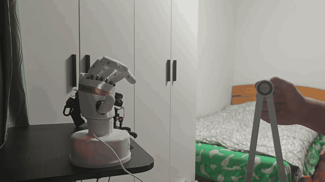
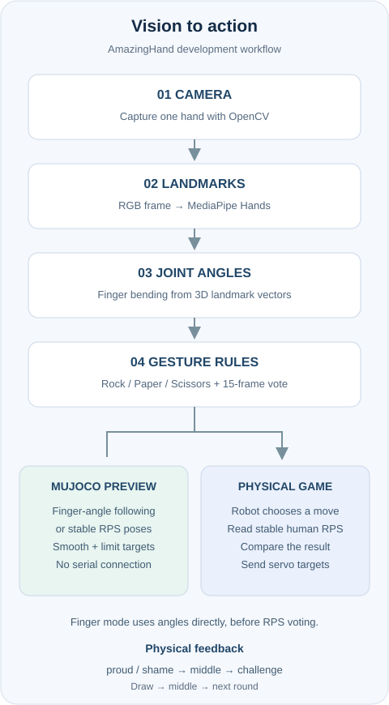
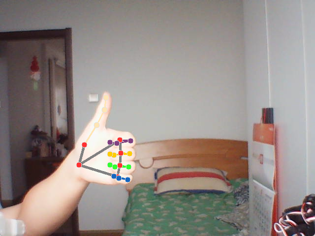
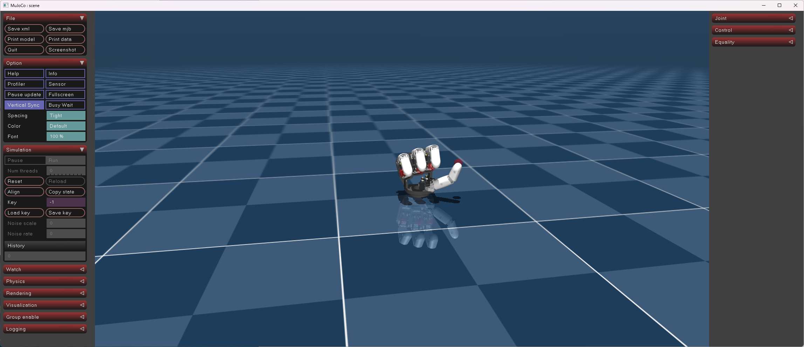
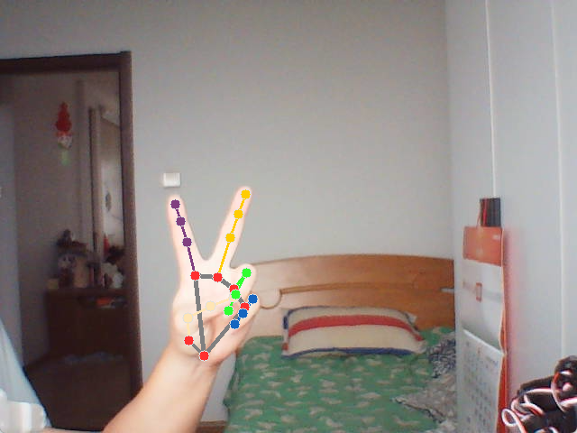
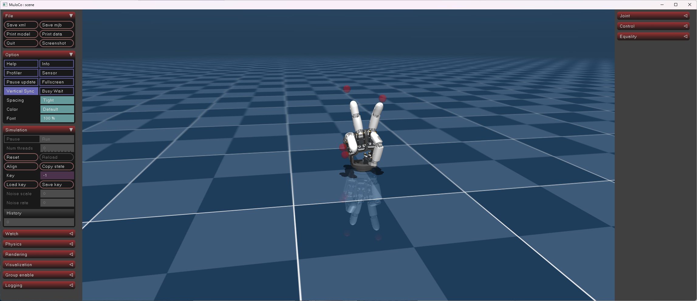

# AmazingHand-Vision-Rock-Paper-Scissors

A vision-based Rock-Paper-Scissors demo with a physical **Pollen Robotics AmazingHand**, plus a camera-driven **MuJoCo sandbox** for testing before connecting the real hand.

I built this project to connect hand gesture recognition, robot control, and expressive human–robot interaction. The application combines MediaPipe landmarks, angle-based gesture rules, temporal voting, and named servo poses. AmazingHand provides the hardware platform; the RPS workflow and integration are the focus of this repository.

## Demo



**Original video 00:24–01:01 · 1.5× speed · approximately 24.7 seconds**

[Full video with original audio](assets/VID_20260912_235052.mp4) · [Media details](assets/README.md)

- Recognizes **rock, paper, and scissors** from a webcam.
- Controls eight AmazingHand servos through a COM serial connection.
- Reacts to the result with **proud**, **shame**, and **challenge** sequences.
- Includes camera-only and MuJoCo modes for development without physical hardware.

In the physical demo, the robot moves first and then waits for the player. Each run contains 20 rounds.

## Architecture and workflow

<p align="center">
  
</p>

My development workflow was to explore poses in MuJoCo, develop the camera and gesture logic separately, and then integrate the real hand. The simulation entry point now supports both finger motion preview and the same RPS rules used by the physical demo.

## Setup

### Hardware

- AmazingHand with four fingers and eight SCS0009 servos, configured as IDs **1–8**.
- A compatible USB-to-TTL servo bus adapter and suitable power supply.
- A webcam and Windows computer. Simulation needs only the computer and webcam.

**Build tip:** I recommend printing **two spare Link parts** from the [official STL collection](https://github.com/pollen-robotics/AmazingHand/tree/main/cad/stl). A Link broke during this experiment, so I personally treat it as a wear-prone part and keep spares available.

### Development environment

| Component | Version |
|---|---|
| Windows | 11 |
| Python | 3.12.14, 64-bit |
| MediaPipe | 0.10.14 |
| NumPy | 2.5.3 |
| OpenCV Python package | 5.0.0.93 (`cv2` runtime 5.0.0) |
| rustypot | 1.7.0 |
| MuJoCo, optional | 3.12.0 |

`requirements.txt` lists the direct dependencies; `requirements-lock.txt` records the full runtime dependency set. Use one GUI-enabled OpenCV package (`opencv-contrib-python`). The code uses MediaPipe's legacy `mp.solutions.hands` API, so keep the pinned MediaPipe version.

### Install

From PowerShell, using a 64-bit Python 3.12 interpreter:

```powershell
git clone https://github.com/zbylink/AmazingHand-Vision-Rock-Paper-Scissors.git
cd AmazingHand-Vision-Rock-Paper-Scissors
python -m venv .venv
.\.venv\Scripts\Activate.ps1
python -m pip install -r requirements-lock.txt
python -m pip check
```

If activation is unavailable, use `.\.venv\Scripts\python.exe` in place of `python`. The dependency snapshot comes from the development environment; a fresh installation on another machine may need platform-specific adjustments.

## Test the camera and simulation first

### Camera-only preview

```powershell
python scripts/vision_test.py --camera 0
```

The window shows landmarks, finger angles, the current gesture, and its stable label. Try each gesture, rotate your hand, and inspect the labels before connecting hardware. Press **Q** to exit; use `--camera 1` if needed.

### Camera → MuJoCo

Install the optional dependency and obtain the official model assets:

```powershell
python -m pip install -r requirements-simulation.txt
git clone --depth 1 https://github.com/pollen-robotics/AmazingHand.git external/AmazingHand
python simulation.py --check-model
python simulation.py --camera 0 --mode fingers
```

`fingers` mode maps the index, middle, ring, and thumb bending angles to the simulated hand. It interpolates between the closed and open poses, smooths the targets, and respects the model's actuator control limits. The pinky participates in gesture classification but has no separate robot finger. This is a finger-bending preview, not full wrist or fingertip-pose retargeting.

To validate the RPS classifier instead:

```powershell
python simulation.py --camera 0 --mode rps
```

`rps` mode uses the same angle thresholds and 15-frame voting rule as the real-hand demo, then applies the corresponding named pose. The camera window shows both raw and stable labels. With no hand visible for 0.5 seconds, the simulation returns to `middle`. Press **Q** in the camera window or close either window to exit. Neither simulation mode opens a serial connection.

The default model is the upstream left-hand `scene.xml`. For an existing AmazingHand checkout, pass its scene path with `--model "C:\path\to\scene.xml"`. Keep the adjacent XML and mesh files together. `--check-model` checks model loading and four poses without opening the camera or a viewer.

### Development snapshots

Examples from camera-to-simulation development: thumb extension and scissors.

| Camera landmarks | MuJoCo hand |
|---|---|
|  |  |
|  |  |

## Run the physical demo

1. Check servo IDs, hand calibration, power, and the adapter's COM port in Windows Device Manager.
2. Edit the controller settings in `hand_control.py`:

   ```python
   Scs0009PyController(serial_port="COM9", baudrate=1000000, timeout=2)
   ```

3. Set the camera index in `main.py` if necessary: `vision = RPSVision(camera_id=0)`.
4. With the hand secured and its motion area clear, run:

   ```powershell
   python test_real_hand.py
   python main.py
   ```

The smoke test performs **middle → shame → middle**. The game then runs 20 rounds, logging the robot move, human gesture, and result. Q is handled while waiting for a human gesture; Ctrl+C interrupts the program.

**Safety:** constructing `AmazingHand()` enables torque immediately. Calibrate the poses for your hand, keep fingers clear of the linkages, and keep a physical power disconnect within reach. Software cleanup is best effort.

## Gesture recognition and rotation invariance

The classifier uses **joint angles**, rather than rules such as “the fingertip is above the knuckle.” For three landmarks A, B, C, it measures the angle at B:

$$
\theta = \cos^{-1}\left(\frac{(A-B)\cdot(C-B)}{\lVert A-B\rVert\,\lVert C-B\rVert}\right)
$$

A rigid rotation preserves vector lengths and dot products, so it preserves this angle. Translation also cancels in the differences. This makes the geometric decision rule **rotation-invariant in landmark space**: the hand does not have to point upward to form rock, paper, or scissors.

`vision.py` computes these angles from MediaPipe's landmark `x`, `y`, and `z` coordinates:

| Finger | Landmarks | Open condition |
|---|---|---|
| Thumb | `(1, 2, 3)` and `(2, 3, 4)` | Both angles > 150° |
| Index | `(5, 6, 7)` | Angle > 160° |
| Middle | `(9, 10, 11)` | Angle > 160° |
| Ring | `(13, 14, 15)` | Angle > 160° |
| Pinky | `(17, 18, 19)` | Angle > 160° |

- **Rock:** all five fingers closed.
- **Paper:** all five fingers open.
- **Scissors:** index and middle open; ring and pinky closed; thumb ignored.
- Other combinations are `UNKNOWN`.

A label becomes stable when it appears at least **10 times in the latest 15 processed frames**. This reduces flicker while the player changes poses.

The angle formula is rotation-invariant, but camera estimates are not perfect rigid 3D measurements: perspective, normalized coordinate scaling, and finger occlusion can still affect recognition at extreme orientations. Keep the hand visible when testing different directions.

## Robot motion and feedback

`poses.py` stores eight target angles in degrees, ordered as two motors per finger: **index → middle → ring → thumb**. `hand_control.py` converts them to radians and writes IDs 1–8 sequentially.

| Result, from the robot's perspective | Feedback |
|---|---|
| Win | `proud` → `middle` → `challenge` |
| Loss | `shame` → `middle` → `challenge` |
| Draw | `middle`, then the next round |

`proud` alternates left/right poses; `shame` interpolates from rock into the shame pose; `challenge` opens and closes the fingers twice. The current physical controller uses stored poses and timed waits rather than measured arrival feedback.

## Project files

| File | Role |
|---|---|
| `main.py` | Physical RPS game loop and outcome logic |
| `vision.py` | Landmark angles, classification, voting, and threaded camera processing |
| `hand_control.py` | Serial servo control and expressive sequences |
| `poses.py` | Named eight-servo target arrays |
| `simulation.py` | Camera-driven MuJoCo preview: `fingers` and `rps` modes |
| `hand_control_mujoco.py` | Earlier simulation controller, retained as a development reference |
| `test_real_hand.py` | Physical motion smoke test |
| `scripts/vision_test.py` | Camera-only diagnostic |
| `tests/` | Hardware-free recognition and mapping tests |
| `scripts/make_demo_gif.ps1` | Rebuild the README GIF with FFmpeg |
| `assets/` | GIF, original video, workflow diagram, and screenshots |

Earlier `rock_test.py`, `paper_test.py`, and `scissors_test.py` experiments were used to tune poses in MuJoCo. For this repository, use `simulation.py` with the official model assets.

## Troubleshooting and next steps

| Issue | Check |
|---|---|
| Camera will not open | Close other camera apps; check Windows camera permissions and camera index |
| Gesture stays unstable | Improve lighting, reduce occlusion, and inspect finger-angle overlays |
| `mediapipe.solutions` missing | Restore the pinned legacy MediaPipe version |
| Serial connection fails | Check COM port, driver, power, baud rate, and unique servo IDs |
| Simulation model missing | Clone the upstream assets or supply `--model` |
| Previous gesture appears in a new round | The physical game still needs stricter per-round buffer synchronization |

Run the hardware-free checks with `python -m unittest discover -s tests -v`. The next improvements are per-round fresh-frame handling, safer startup/shutdown, configurable ports and poses, and recognition/latency measurements. Simulation is useful for camera and gesture debugging; physical travel limits still need to be checked on the assembled hand.

## Credits and license

- [Pollen Robotics AmazingHand](https://github.com/pollen-robotics/AmazingHand): hand design, assembly/calibration resources, control examples, and simulation models.
- [MediaPipe](https://github.com/google-ai-edge/mediapipe): hand landmark estimation.
- [OpenCV](https://opencv.org/): camera capture and visualization.
- [rustypot](https://github.com/pollen-robotics/rustypot): servo communication.
- [NumPy](https://numpy.org/): pose arithmetic and interpolation.
- [MuJoCo](https://github.com/google-deepmind/mujoco): simulation.

My contribution is the RPS application, gesture logic, pose/feedback sequences, and hardware integration. The upstream hardware design, models, and libraries remain credited to their authors.

Project code: [MIT License](LICENSE). Upstream materials retain their own licenses; AmazingHand identifies Apache-2.0 for software and CC BY 4.0 for mechanical design. The upstream Apache license is included in [docs/UPSTREAM-Apache-2.0.txt](docs/UPSTREAM-Apache-2.0.txt).
